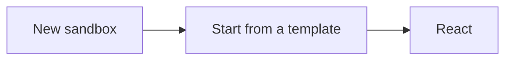

import LearningObjectives from "@site/src/components/LearningObjectives";

# Creating a Spell Card Library with React

This tutorial assumes you have basic knowledge of React and JavaScript. By the end of this tutorial we'll have a web application that lists every spell in the game. We can use this as a jumping-off point for whatever our hearts desire!

- Add filters to only show spells of specific levels
- Add a shuffle button that picks a random spell
- etc. WIP TODO: Rule of 3

<LearningObjectives
  objectives={[
    "Learn to interact with the API using HTTP requests in JavaScript",
    "Learn to create reusable React components",
  ]}
/>

## Setting Up the Project

We'll be using [CodeSandbox](codesandbox.io) for this project because it gives us a quick starting point for our React code. Anything you write in your CodeSandbox project should be easily transportable to whatever React project you want to build.

### Making your Project on CodeSandbox

We'll be creating a new **React** project. If you feel comfortable with TypeScript you can use the **React TypeScript** project just as well.



### Adding some Code

**Setup an api file to help make fetching from the D&D 5e API easier.** This keeps our api code in one place and lets us easily extend it if we want to add more endpoints. Click on the "New File" button next to the `src` folder in your CodeSandbox sidebar and make a new file called `api.js`:

We can get all the spells in the 5e D&D API by making a request to `https://www.dnd5eapi.co/api/spells`. Let's go ahead and save that base url to a variable so we don't have to retype it in the future.

```js title="/src/api.js"
const BASE_URL = "https://www.dnd5eapi.co";

export async function getAllSpells() {
  return fetch(BASE_URL + "/api/spells").then((response) => response.json());
}
```

If we run this function that we're exporting, we get a response of the following shape:

```js
{
  count: 319,
  results: [
    {
      index: "acid-arrow"
      name: "Acid Arrow"
      url: "/api/spells/acid-arrow"
    },
      // ...
  ]
}
```

## Setting up our Data

The `index` is the unique id of this spell, `name` is a formatted string we can show our users, and `url` is a path to the spell in the API.

Since we're going to want all of the spell data in our app, let's tweak that function a bit to actually pull the full spells down:

```js title="/src/api.js"
const BASE_URL = "https://www.dnd5eapi.co";

export async function getAllSpells() {
  const spellIndexes = await fetch(BASE_URL + "/api/spells").then((response) =>
    response.json()
  );
  return Promise.all(
    spellIndexes.results.map((index) =>
      fetch(BASE_URL + index.url).then((response) => response.json())
    )
  );
}
```

This might lag, but we'll figure that out later.

> "Make it work, make it right, make it fast"

If we run the function now, we'll get a lot more information from our spells. We mostly care about `name`, `level`, and `desc` for now but you can see everything the endpoint gives you [in the API reference](/docs/api/get-a-spell-by-index)

## Rendering our Spell Cards

`App.js` is where the bulk of our code will be. We have to load the spells when we mount the component, and then loop through our spells and render each one.

```js title="/src/App.js"
import { useEffect, useState } from "react";
import { getAllSpells } from "./api";
import "./styles.css";

export default function App() {
  const [spells, setSpells] = useState([]);

  useEffect(() => {
    getAllSpells().then(setSpells);
  }, []);

  return (
    <div className="App">
      <ul>
        {spells.map((spell) => (
          <li>{spell.name}</li>
        ))}
      </ul>
    </div>
  );
}
```

Alright! Now our app shows a bulleted list of spells. This is a great start, but we can make it look better. Let's hop into the css:

```css title="/src/styles.css"

```
