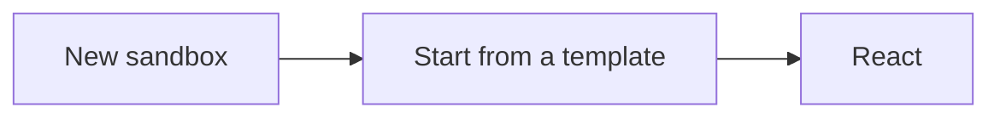

import LearningObjectives from "@site/src/components/LearningObjectives";

# Creating a Spell Card Library with React

This tutorial assumes you have basic knowledge of CSS, React and JavaScript. Specifically,

- [How to write JSX](https://react.dev/learn/writing-markup-with-jsx)
- [How to make and call asynchronous functions](https://javascript.info/async-await)

You can brush up your knowledge on these subjects using the links provided and then drop back in!

By the end of this tutorial we'll have a web application that lists every spell in the game. We can use this as a jumping-off point for whatever our hearts desire!

- Add filters to only show spells of specific levels
- Add a shuffle button that picks a random spell
- Add a search bar that searches through spell names & descriptions

<LearningObjectives
  objectives={[
    "Learn to interact with the API using HTTP requests in JavaScript",
    "Learn to create reusable React components",
  ]}
/>

## Setting Up the Project

We'll be using [CodeSandbox](https://codesandbox.io) for this project because it gives us a quick starting point for our React code. Anything you write in your CodeSandbox project should be easily transportable to whatever React project you want to build.

### Making your Project on CodeSandbox

We'll be creating a new **React** project. If you feel comfortable with TypeScript you can use the **React TypeScript** project just as well.



### Adding some Code

**Setup an api file to help make fetching from the D&D 5e API easier.** This keeps our api code in one place and lets us easily extend it if we want to add more endpoints. Click on the "New File" button next to the `src` folder in your CodeSandbox sidebar and make a new file called `api.js`:

We can get all the spells in the 5e D&D API by making a request to `https://www.dnd5eapi.co/api/spells`. Let's go ahead and save that base url to a variable so we don't have to retype it in the future.

```js title="/src/api.js"
const BASE_URL = "https://www.dnd5eapi.co";

export async function getAllSpells() {
  return fetch(BASE_URL + "/api/spells").then((response) => response.json());
}
```

If we run this function that we're exporting, we get a response of the following shape:

```js
{
  count: 319,
  results: [
    {
      index: "acid-arrow",
      level: 2,
      name: "Acid Arrow",
      url: "/api/spells/acid-arrow"
    },
      // ...
  ]
}
```

## Setting up our Data

The `index` is the unique id of this spell, `name` is a formatted string we can show our users, and `url` is a path to the spell in the API.

Since we're going to want all of the spell data in our app, let's tweak that function a bit to actually pull the full spells down:

```js title="/src/api.js"
const BASE_URL = "https://www.dnd5eapi.co";

export async function getAllSpells() {
  const spellIndexes = await fetch(BASE_URL + "/api/spells").then((response) =>
    response.json()
  );
  return Promise.all(
    spellIndexes.results.map((index) =>
      fetch(BASE_URL + index.url).then((response) => response.json())
    )
  );
}
```

This might lag, but we'll figure that out later.

> "Make it work, make it right, make it fast"

If we run the function now, we'll get a lot more information from our spells. We mostly care about `name`, `level`, and `desc` for now but you can see everything the endpoint gives you [in the API reference](/docs/api/get-a-spell-by-index)

## Rendering our Spell Cards

`App.jsx` is where the bulk of our code will be. We have to load the spells when we mount the component, and then loop through our spells and render each one.

```jsx title="/src/App.jsx"
import { useEffect, useState } from "react";
import { getAllSpells } from "./api";
import "./styles.css";

export default function App() {
  const [spells, setSpells] = useState([]);

  useEffect(() => {
    getAllSpells().then(setSpells);
  }, []);

  return (
    <div className="App">
      <ul>
        {spells.map((spell) => (
          <li key={spell.index}>{spell.name}</li>
        ))}
      </ul>
    </div>
  );
}
```

Alright! Now our app shows a bulleted list of spells. This is a great start, but we can make it look better. First, let's create a SpellCard component and pull out some more info that we want from the spell object:

```jsx title="/src/SpellCard.jsx"
export default function SpellCard({ spell }) {
  return (
    <li className="spell-card">
      <hgroup>
        <h4>{spell.name}</h4>
        <small>
          {spell.level > 0 && `Level ${spell.level} `}
          {spell.school.name}
          {spell.level === 0 && " cantrip"}
        </small>
      </hgroup>
      <div className="stats">
        <p>
          <strong>Casting Time</strong>
          {spell.casting_time}
        </p>
        <p>
          <strong>Range</strong>
          {spell.range}
        </p>
        <p>
          <strong>Components</strong>
          {spell.components.join(", ")}
        </p>
        <p>
          <strong>Duration</strong>
          {spell.duration}
        </p>
      </div>
    </li>
  );
}
```

Now that we have our separate component, we need to pull it into our App.jsx:

```jsx title="/src/App.jsx"
import { useEffect, useState } from "react";
import { getAllSpells } from "./api";
import SpellCard from "./SpellCard";
import "./styles.css";

export default function App() {
  const [spells, setSpells] = useState([]);

  useEffect(() => {
    getAllSpells().then(setSpells);
  }, []);

  return (
    <div className="App">
      <ul className="spell-list">
        {spells.map((spell) => (
          <SpellCard key={spell.index} spell={spell} />
        ))}
      </ul>
    </div>
  );
}
```

And now that we have some more details displaying, let's hop into the styles and organize it a bit better

<iframe
  src="https://codesandbox.io/embed/d-d-5e-spell-cards-jsvnct?fontsize=14&hidenavigation=1&module=%2Fsrc%2Fstyles.css&theme=dark"
  style={{
    width: "100%",
    height: "500px",
    border: 0,
    borderRadius: "4px",
    overflow: "hidden",
  }}
  title="D&amp;D 5e Spell Cards"
  allow="accelerometer; ambient-light-sensor; camera; encrypted-media; geolocation; gyroscope; hid; microphone; midi; payment; usb; vr; xr-spatial-tracking"
  sandbox="allow-forms allow-modals allow-popups allow-presentation allow-same-origin allow-scripts"
></iframe>

Looking good! We can review [the entire project](https://codesandbox.io/s/d-d-5e-spell-cards-jsvnct) and see how all our code came together in the end!

## Bonus

Depending on our connection, these cards could take a hot minute to load! Let's add a loading indicator and make sure we're caching the request so subsequent visits can be faster.

There are plenty of libraries that can help with this like [Reacy Query](https://tanstack.com/query/v3) but we'll just do it manually.

First, we'll add an indicator that we're loading. Let's just keep it plain text for now...

```jsx title="/src/App.jsx"
return (
  <div className="App">
    {spells.length === 0 && <span className="loading">Loading...</span>}
    <ul className="spell-list">
      {spells.map((spell) => (
        <SpellCard key={spell.index} spell={spell} />
      ))}
    </ul>
  </div>
);
```

And then we'll modify our useEffect to use [localStorage](https://developer.mozilla.org/en-US/docs/Web/API/Window/localStorage) to save our spells and load them if available:

```jsx title="/src/App.jsx"
useEffect(() => {
  const savedSpells = localStorage.getItem("spells");
  if (savedSpells) setSpells(JSON.parse(savedSpells));
  getAllSpells().then((spells) => {
    setSpells(spells);
    localStorage.setItem("spells", JSON.stringify(spells));
  });
}, []);
```

And boom! Now the page will render our saved list and then update with the new list (and save that one) just in case there are any changes.
